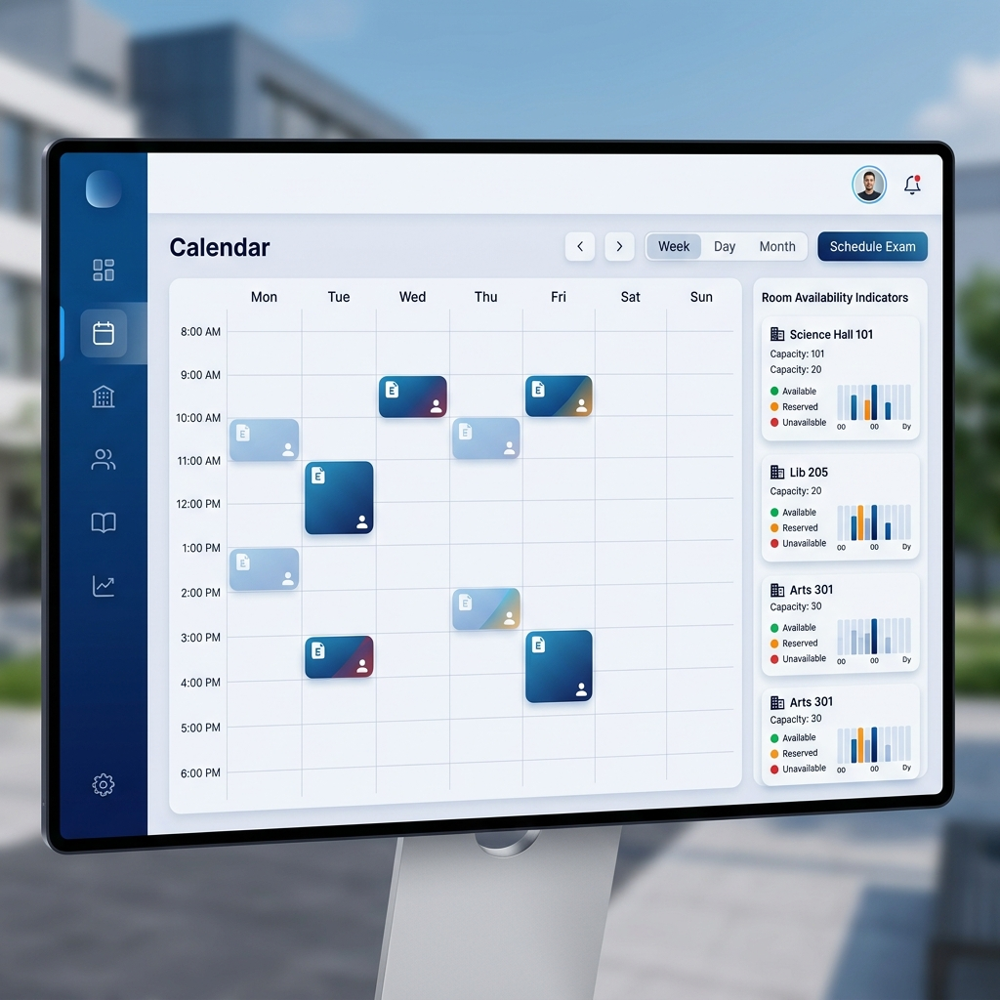
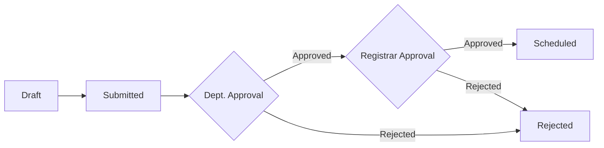

<div align="center">

# 🎓 Exam Scheduler Pro
### A comprehensive university exam management & scheduling system

[](https://laravel.com)
[](https://reactjs.org)
[](https://www.mysql.com)
[](https://vitejs.dev)



</div>

---

## 🌟 Overview / نظرة عامة

**Exam Scheduler Pro** is a sophisticated platform designed for university administrators and coordinators to streamline the complex process of exam scheduling. It handles everything from Excel data imports to conflict detection and final report generation.

**نظام جدولة اختبارات جامعي متكامل** يهدف إلى تسهيل عملية تنظيم الاختبارات، بدءاً من رفع جداول المحاضرات وحتى استخراج الجداول النهائية، مع ضمان عدم وجود تعارضات في القاعات أو الموارد.

---

## ✨ Key Features

- 📊 **Excel Integration**: Seamlessly upload and analyze lecture schedules.
- 🔍 **Smart Availability**: Real-time room availability tracking by faculty and time slots.
- 🛡️ **Conflict Prevention**: Advanced engine to detect room, instructor, and student capacity conflicts.
- 📅 **Interactive Calendar**: Comprehensive view of all scheduled exams with advanced filtering.
- 📑 **Professional Exports**: Generate high-quality Excel and PDF reports.
- 📝 **Audit Logging**: Complete transparency with an operator-based activity log.
- ⚡ **Modern UI**: Blazing fast interface built with React 18 and Vite.

---

## 🛠️ Technology Stack

| Component | Technology |
| :--- | :--- |
| **Backend** | Laravel 11 (PHP 8.2+) |
| **Frontend** | React 18 + Vite |
| **Styling** | Vanilla CSS / Tailwind |
| **Database** | MySQL 8 |
| **Reports** | Laravel Excel & DomPDF |

---

## 🚀 Quick Start

If you have the environment ready, you can use the provided batch files:

1. **Install Dependencies**: Double-click `install.bat`
2. **Start Development**: Double-click `start-dev.bat`

---

## ⚙️ Detailed Installation

<details>
<summary><b>1. Backend Setup (Laravel)</b></summary>

```bash
cd backend-php
composer install
cp .env.example .env
php artisan key:generate
```

**Configure `.env`:**
```env
DB_DATABASE=exam_scheduler
DB_USERNAME=root
DB_PASSWORD=your_password

# Exam Timing Configuration
EXAM_WORK_START=08:00
EXAM_WORK_END=18:00
```

**Run Migrations & Seeds:**
```bash
php artisan migrate
php artisan db:seed --class=RoomSeeder
```

**Start Backend:**
```bash
php artisan serve
```
</details>

<details>
<summary><b>2. Frontend Setup (React)</b></summary>

```bash
cd frontend
npm install
npm run dev
```
</details>

---

## 📂 Project Structure

```text
├── backend-php/          # Laravel REST API
│   ├── app/              # Business logic & Services
│   ├── database/         # Migrations & Seeders
│   └── routes/           # API Endpoints
├── frontend/             # React Application
│   ├── src/pages/        # UI Components & Views
│   └── src/api.js        # API Communication Layer
└── docs/                 # Documentation & Assets
```

---

## 🔄 Approval Workflow

The system implements a multi-stage approval process to ensure data integrity:



---

## 👤 Operator Identity

This project operates in a **"No-Login Mode"** for streamlined administrative use. All actions are attributed to the "Exam Coordinator" by default. You can customize this in:
`frontend/src/config/operator.js`

---

## 🛠️ Troubleshooting

| Issue | Solution |
| :--- | :--- |
| **SQL Errors** | Run `php artisan migrate` to ensure schema is up to date. |
| **CORS Issues** | Check `config/cors.php` and allow `http://localhost:5173`. |
| **Missing Classes** | Run `composer dump-autoload`. |
| **Vite Errors** | Ensure `npm install` was successful in the frontend folder. |

---

<div align="center">
Built with ❤️ for University Administration
</div>
